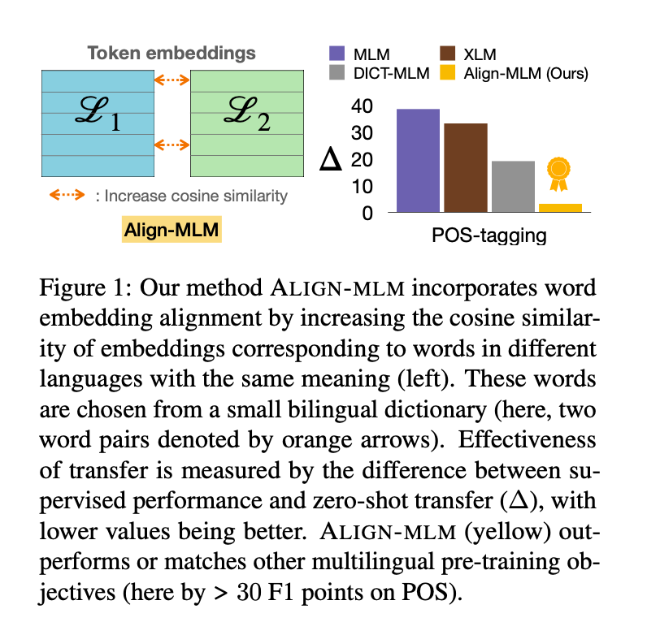

# ALIGN-MLM: Word Embedding Alignment is Crucial for Multilingual Pre-training

This repository contains code for our paper titled ["ALIGN-MLM: Word Embedding Alignment is Crucial for Multilingual Pre-training"]() [[arXiv]](https://arxiv.org/pdf/2211.08547.pdf). It takes inspiration from ["When is BERT Multilingual? Isolating Crucial Ingredients for Cross-lingual Transfer"](https://arxiv.org/pdf/2110.14782.pdf), and is forked from the corresponding codebase [here](https://github.com/princeton-nlp/MultilingualAnalysis).

## Table of contents
1. [Paper in a nutshell](#nutshell)
1. [Installation](#installation)
1. [Repository usage](#usage)
1. [Links to experiments and results](#wb)
1. [Citation](#citation)

## Paper in a nutshell <a name="nutshell"></a>
Multilingual pre-trained models exhibit zeroshot cross-lingual transfer, where a model finetuned on a source language achieves surprisingly good performance on a target language. While studies have attempted to understand
transfer, they focus only on **MLM**, and the large number of differences between natural languages makes it hard to disentangle the importance of different properties.
In this paper, we specifically highlight the importance of word embedding alignment by proposing a pretraining objective (**ALIGN-MLM**) whose auxiliary loss guides similar words in different languages to have similar word embeddings.
**ALIGN-MLM** either outperforms or matches three widely adopted objectives (**MLM**, **XLM**, **DICT-MLM**) when we evaluate transfer between pairs of natural languages and their counterparts created by systematically modifying specific properties like the script.
We also show a strong correlation between alignment and transfer for all objectives (e.g., ρs = 0.727 for _XNLI_), which together with **ALIGN-MLM**’s strong performance calls for explicitly aligning word embeddings for multilingual models.



## Installation instructions <a name="installation"></a>

1.  **Step 1:** Install from the conda `.yml` file.
``` bash
$ conda env create -f installation/multilingual.yml
```
  
* If you receive the a `pip` error involving `torch 1.7.1+cu101`, then run the following command to resolve it

``` bash
$ pip install torch==1.7.1+cu101 torchvision==0.8.2+cu101 torchaudio==0.7.2 -f https://download.pytorch.org/whl/torch_stable.html
```

2. **Step 2:** Install `transformers` in an editable way.
``` bash
pip install -e transformers/
pip install -r transformers/examples/language-modeling/requirements.txt
pip install -r transformers/examples/token-classification/requirements.txt
```

## Repository usage <a name="usage"></a>
We study three kinds of transformations all models: _Transliteration_, _Inversion_, and _Syntax Transformation_. _Inversion_ and _Syntax Transformation_ corpora have already been generated, while _Transliteration_ is an option at runtime.

### Bilingual pre-training
For all pretraining experiments, we use the transitive version of the scripts, because pass in two sources of input text: the original English corpus, as well as the inverted/syntax transformed corpus.

1. **MLM**

    Use the flag `--one_to_one_mapping` for the _Transliteration_ transformation.

``` bash
python transformers/examples/language-modeling/run_mlm_synthetic_transitive.py --warmup_steps 10000 --learning_rate 1e-4 --save_steps -1 --max_seq_length 512 --logging_steps 50 --overwrite_output_dir --model_type roberta --config_name config/en/roberta_8/config.json --tokenizer_name config/en/roberta_8/ --do_train --do_eval --max_steps 500000 --per_device_train_batch_size 16 --per_device_eval_batch_size 16 --train_file <english_train_corpus> --transitive_file <synthetic_train_corpus> --validation_file <validation_corpus> --output_dir <dir_to_store_model> --run_name <name_of_this_run> --one_to_one_mapping --word_modification replace
```

2. **XLM** <a name="xlm"></a>

    Use the flag `--tlm_generation_rate` to control the amount of TLM data generated relative to MLM. If `--one_to_one_mapping` is selected, you can also use the flag `--one_to_one_file` to link to a file that contains explicit one to one mappings. Note this file can contain a mapping for only a subset of the vocabulary, which results in the two languages having vocabulary overlap. Example command below.

``` bash
python transformers/examples/language-modeling/run_tlm_synthetic_transitive.py --warmup_steps 10000 --learning_rate 1e-4 --save_steps -1 --max_seq_length 512 --logging_steps 100 --overwrite_output_dir --model_type roberta --config_name config/en/roberta_8/config_tlm.json --tokenizer_name config/en/roberta_8/ --do_train --do_eval --max_steps 500000 --per_device_train_batch_size 16 --per_device_eval_batch_size 16 --train_file <english_train_corpus> --train_synthetic_file <synthetic_train_corpus> --validation_file <english_validation_corpus> --validation_synthetic_file <synthetic_validation_corpus> --output_dir <dir_to_store_model> --run_name <name_of_this_run> --one_to_one_mapping --word_modification replace --tlm_generation_rate 0.25 --one_to_one_file <one_to_one_file>
```

3. **DICT-MLM**

    Use the flag `--bilingual_rate` to control the percentage of tokens in the bilingual dictionary between the two languages. Example command below.

```bash
python transformers/examples/language-modeling/run_dictmlm_synthetic_transitive.py --warmup_steps 10000 --learning_rate 1e-4 --save_steps -1 --max_seq_length 512 --logging_steps 100 --overwrite_output_dir --model_type roberta --config_name config/en/roberta_8/config_dictmlm.json --tokenizer_name config/en/roberta_8/ --do_train --do_eval --max_steps 500000 --per_device_train_batch_size 16 --per_device_eval_batch_size 16 --train_file <english_train_corpus> --train_synthetic_file <synthetic_train_corpus> --validation_file <english_validation_corpus> --validation_synthetic_file <synthetic_validation_corpus> --output_dir <dir_to_store_model> --run_name <name_of_this_run> --one_to_one_mapping --word_modification replace --bilingual_rate 0.50
```

4. **ALIGN-MLM**.

    Use the flag `--alignment_loss_weight` to control the strength of the alignment loss during training. Example command below.

``` bash
python transformers/examples/language-modeling/run_alignedmlm_synthetic_transitive.py --warmup_steps 10000 --learning_rate 1e-4 --save_steps -1 --max_seq_length 512 --logging_steps 50 --overwrite_output_dir --model_type roberta --config_name config/en/roberta_8/config_alignedmlm.json --tokenizer_name config/en/roberta_8/ --do_train --do_eval --max_steps 500000 --per_device_train_batch_size 16 --per_device_eval_batch_size 16 --train_file <english_train_corpus> --transitive_file <synthetic_train_corpus> --validation_file <validation_corpus> --output_dir <dir_to_store_model> --run_name <name_of_this_run> --one_to_one_mapping --word_modification replace --alignment_loss_weight 10 --bilingual_rate 0.50
```

### Finetuning and Zero-Shot Evaluation
Finetuning and zero-shot evaluation are tested on three tasks: _XNLI_, _NER_, and _POS_. _XNLI_ uses the  `run_glue_synthetic` scripts, while both _NER_ and _POS_ use `run_ner_synthetic` (but with different inputs and models to account for the different types of tags).

### Scripts for Data Generation, Pretraining, Finetuning, and Evaluation
1. [This directory](preprocessing/corpus_inversion/) contains scripts used to invert pretraining and finetuning corpora.
2. [This directory](scripts/alignedmlm_paper_experiments/) contains scripts used for downstream fine-tuning and evaluation.
3. [This directory](analysis/alignedmlm_paper_analysis/) contains scripts used to analyze word embedding alignment between pairs of languages.
4. [This directory](synthetic_language_files/word_based/configuration_files/) contains premade one-to-one mapping files with word overlap for use with XLM models. See [XLM](#XLM) for more information.
5. For all other scripts, such as the data generation of the original English corpus, see [here](https://github.com/princeton-nlp/MultilingualAnalysis).

## Links to experiments and results <a name="wb"></a>
[Here](https://docs.google.com/spreadsheets/d/1lBTfouNM_xNQnOvI4AXnIIaA8EPoHj5R5C5dJOdlzCM/edit?usp=sharing) is the spreadsheet with all results, and weights and biases links.

The full models were trained on Google’s Cloud Compute platform. In particular, we utilized a 12 core vCPU VM with 96 GB of memory. The machine was associated with a Debian GNU/Linux 10 Buster + PyTorch/XLA bootdisk boot disk of 300 GB in size. We used v3-8 Google TPUs on Pytorch-1.11.

The setup script can be found [here](scripts/tpu_gcloud_setup.sh).

## Citation <a name="wb"></a>
Please consider citing if you used our paper in your work!

```
@article{tang2022align,
  title={ALIGN-MLM: Word Embedding Alignment is Crucial for Multilingual Pre-training},
  author={Tang, Henry and Deshpande, Ameet and Narasimhan, Karthik},
  journal={arXiv preprint arXiv:2211.08547},
  year={2022}
}
```
